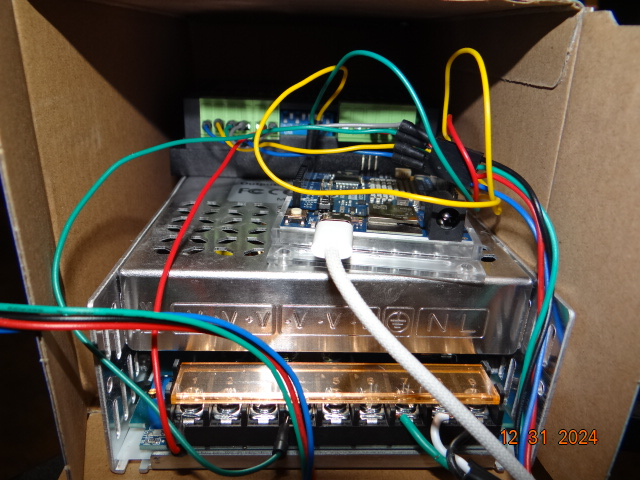
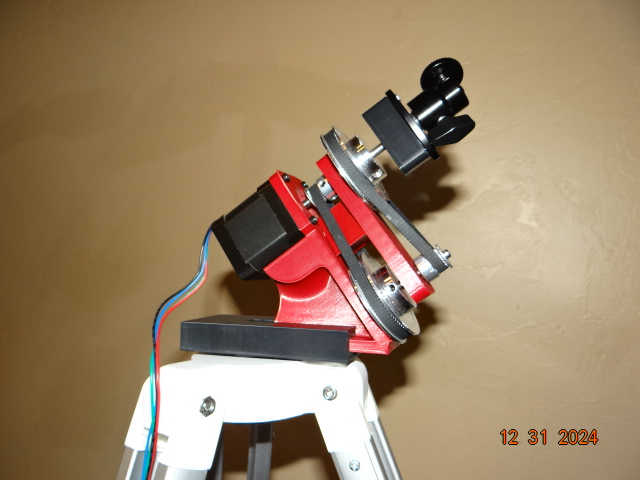
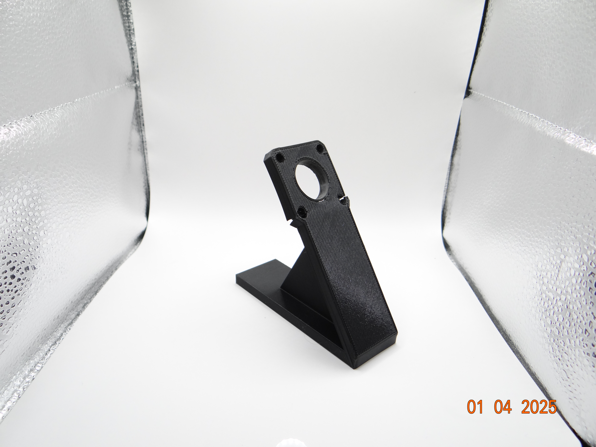

# The SkyTracker v3

This is the functional 16:1 belt gear box designed to supply steady controllable rotation to a camera (eventually a telescope).

This is the internal assembly.

## Impetus

I began this project shortly after embarking into my hobby of amateur astronomy. Sky-tracking telescopes are a bit expensive, and I had a simple analogue telescope. I decided it would be more economical to build my own. This v3 is designed to work with my camera, with further iterations planned to allow me to mount my telescope, and ultimately record and control the telescope view remotely with a Raspberry Pi and additional motors.

## Design

This features a simple stepper motor driven by a microstep driver and Arduino. It is rigged up to some standard belt pulleys at a rev reduction of 16:1. The reason for this was that the v1 with the stepper alone did not offer enough microsteps to smoothly track distant objects (25600steps/rev), it worked out to approximately 1 step per 4 seconds, i.e. ~60 arcseconds per step. The sky appears to rotate about us at a rate of 15 arcseconds per second, and I had to overcompensate for the size of the individual pixel sensors in my camera such that the movement would not create too much streaking during long exposure photography. The belt pulleys added in v2 offer 16x the steps per second by operating the motor 16x faster with the same 25600 steps per revolution, translating to about ~3.75 arcseconds per step, and it looks smooth! The tension in the belt pulley design has the double benefit of removing the majority of the jitter in the shot due to the choppy nature of stepper motors. In v3 I designed a gearbox with bearings at two points on each pulley axle so that the leverage presented into the v2 by the weight of the payload (in this case my camera) does not bend the assembly out of alignment with the target or alignment with celestial north.

## How it works

The v3 is controlledby an Arduino that holds the timing instructions and translating into motor impulse controls for a microstep driver. The driver supplies the correct power and impulses to the motor so that it rotates 16 times in 24 hours. The power supply is 24V, 25A, 600W DC, and provides power to the motor vis-a-vis the driver. My prototype is rigged up so that I can plug it into wall power and it will begin operating automatically.

### Viewing Celestial Bodies

In order to use this device effectively, the rotation axis must be pointing directly at Polaris so that it co-rotates with the sky. I intend to create easier sighting mechanisms than the current method of eyeballing the lineup, perhaps a small magnification crosshair scope. After that, it is simply a matter of pointing the camera at the desired target.

## The SkyTracker v2

## The SkyTracker v1

You may notice the fractures in this picture and these were caused by heat buildup in the motor melting the PLA. I was conducting an endurance test at the time as to how long the system could keep the Moon centered in frame. The rig worked for several hours until the moon was visibly not centered on screen. This let me know I had my targeting correct, but it was far too jittery, and in the end, melted the mount.

## Author

**James**  
Creator and amateur astronomer. This project is part of my ongoing exploration of DIY solutions to enhance my stargazing hobby.